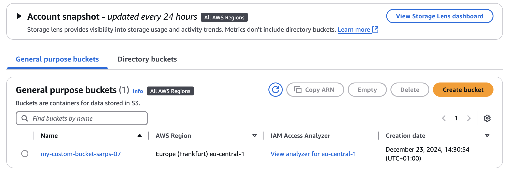
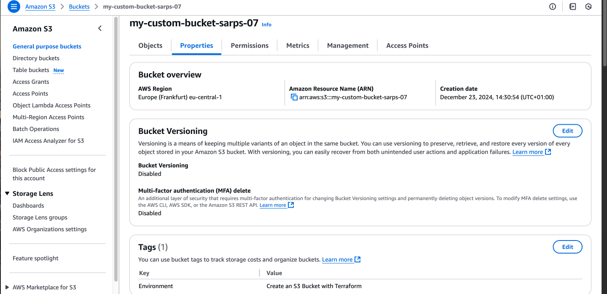
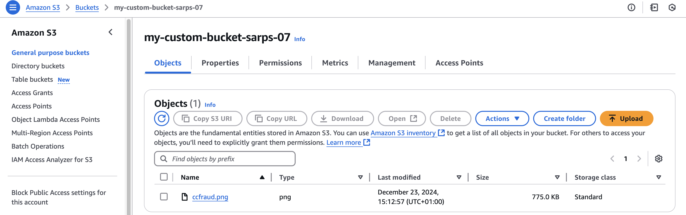

# Terraform Project: Creating an AWS S3 Bucket

## Overview

This project demonstrates how to use Terraform to automate the creation of an AWS S3 bucket. By defining the infrastructure as code, Terraform eliminates repetitive manual processes and ensures consistent and scalable deployments. This README guides you through the project setup, implementation, and features.

## Why Terraform?

Traditional infrastructure management often involves logging into the AWS console and manually clicking through the setup process. While this works for small-scale deployments, it quickly becomes tedious and error-prone as the infrastructure grows.

Terraform simplifies this by:

- Automating infrastructure provisioning and management.
- Enabling version control and collaboration for infrastructure configurations.
- Supporting reproducibility across different environments.

## Project Features

This project demonstrates:

1. Creating an S3 bucket with tags to organize resources.
2. Enforcing public access restrictions on the bucket.
3. Uploading an object (file) to the bucket.

## Prerequisites

1. [Install Terraform](https://developer.hashicorp.com/terraform/downloads):
   - macOS: `brew install terraform`
   - Linux: `sudo apt-get install terraform`
   - Windows: Download and add `terraform.exe` to your system PATH.
2. [Install AWS CLI](https://docs.aws.amazon.com/cli/latest/userguide/install-cliv2.html).
3. Configure AWS credentials:
   ```bash
   aws configure
   ```
   Provide your Access Key ID, Secret Access Key, and preferred region (e.g., `eu-central-1`).

## Project Setup

1. **Create a Project Directory:**

   ```bash
   mkdir nxt_terraform
   cd nxt_terraform
   ```

2. **Initialize Git for Version Control (Optional):**

   ```bash
   git init
   ```

3. **Create the Terraform Configuration File:** Save the following code in a file named `main.tf`:

   ```hcl
   provider "aws" {
     region = "eu-central-1" # Update this to the Region closest to you
   }

   resource "aws_s3_bucket" "my_bucket" {
     bucket = "my-custom-bucket-sarps-07" # Replace placeholders with your name and a random number
      ##

     tags = {
       Environment = "Create an S3 Bucket with Terraform"
      ##
     }
   }

   resource "aws_s3_bucket_public_access_block" "my_bucket_public_access_block" {
     bucket                  = aws_s3_bucket.my_bucket.id

     block_public_acls       = true
     ignore_public_acls      = true
     block_public_policy     = true
     restrict_public_buckets = true
   }

   resource "aws_s3_object" "image" {
     bucket = aws_s3_bucket.my_bucket.id  # Reference the bucket ID
     key    = "ccfraud.png"              # Path in the bucket
     source = "ccfraud.png"              # Local file path
      ##
   }
   ```

## Steps to Deploy

1. **Initialize Terraform:**

   ```bash
   terraform init
   ```

   This downloads necessary plugins for AWS.

2. **Preview the Changes:**

   ```bash
   terraform plan
   ```

   Terraform shows a plan of the resources it will create.

3. **Apply the Configuration:**

   ```bash
   terraform apply
   ```

   Review the proposed changes and type `yes` to confirm. Terraform will create the S3 bucket and configure it as specified.

4. **Verify the Bucket:**

   - **AWS Console:** Navigate to the S3 service in your AWS Console and confirm the bucket exists.
   - **AWS CLI:** Run:
     ```bash
     aws s3 ls
     ```

## Going Further

This project is a starting point. You can extend it by:

- Adding bucket policies to manage access.
- Enabling versioning for object management.
- Configuring lifecycle rules to manage object storage.
- Managing other AWS resources such as EC2 instances, VPCs, and databases.

## Benefits of Using Terraform

1. **Automation:** Reduces manual effort and potential errors.
2. **Reproducibility:** Ensures consistent infrastructure deployments.
3. **Version Control:** Enables tracking and collaboration on infrastructure configurations.
4. **Scalability:** Simplifies managing large and complex infrastructures.

## Key Commands

- Initialize Terraform: `terraform init`
- Plan Changes: `terraform plan`
- Apply Configuration: `terraform apply`
- Destroy Resources: `terraform destroy`

## Resources

- [Terraform Documentation](https://developer.hashicorp.com/terraform/docs)
- [AWS S3 Documentation](https://docs.aws.amazon.com/s3/index.html)
- [HashiCorp Learn: Terraform](https://learn.hashicorp.com/terraform)

---

